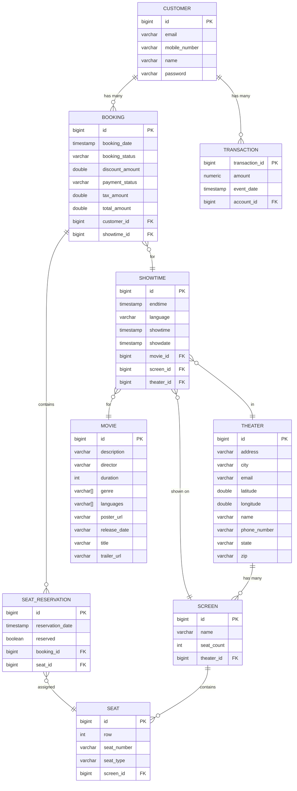
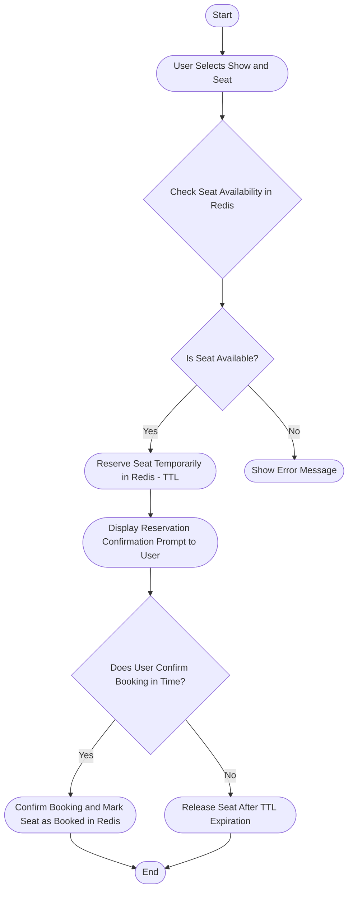
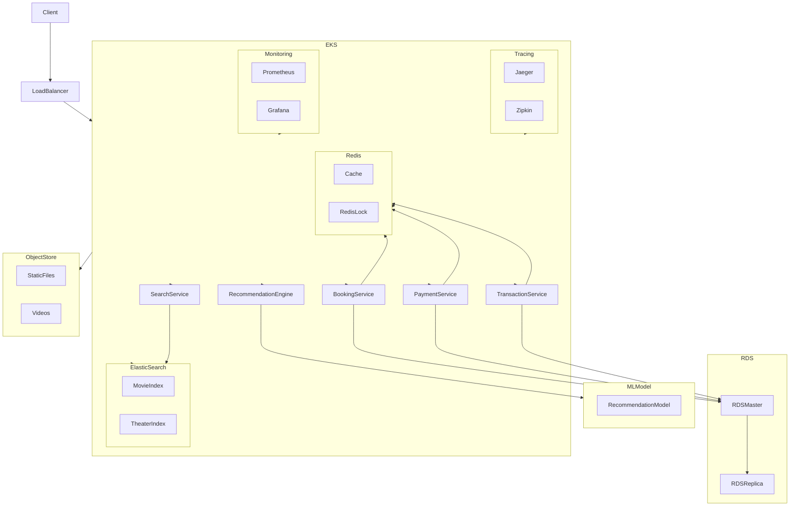

# Movie Ticket Booking System

## Overview

This project is a movie ticket booking system built with Spring Boot, JPA, and Redis for synchronization and locking. It allows users to book multiple seats for a movie showtime, ensuring concurrency and consistency in a distributed environment.

## Table of Contents
- Features
- Technologies Used
- Endpoints
- Running Tests
- Swagger API Documentation
- Security Configuration
- Database Structure
- Depedency Report

## Features

- Book multiple seats for a movie showtime
- Concurrent seat reservation with Redis distributed locks
- Release expired seat reservations
- Confirm seat reservations
- Find theaters by movie ID and show date

## Technologies Used

- Spring Boot
- Spring Data JPA
- Redisson (Redis-based distributed locks)
- Postgresql (for development and testing)
- Maven (for dependency management)

## Prerequisites

- JDK 17
- Maven
- Redis server (running on localhost:6379)
- Postgresql
- Docker


### Run application with Docker compose

1. <b>Clone the repository </b>:
    ```bash
    git clone https://github.com/harsh2792/transaction-service.git
    cd transactions-service
    ```
 
2. <b>Create build using maven </b>:

```bash
mvn clean package -DskipTests
```

3. <b>Build the Docker Images</b>: Build the Docker images using the following command:
```bash
docker-compose build
```

4. <b>Verify the Services</b>: Verify that the services are running correctly by checking the logs:

```bash
docker-compose logs
```

5. <b>Stop the Services</b>: Stop the services using the following command:

```bash
docker-compose down
```

## Endpoints

TODO: Endpoint details

## Unit Tests

Unit tests are essential to ensure that your application behaves as expected. In this project, unit tests are written using JUnit and Spring Boot's testing framework. These tests cover various aspects of the application, including service logic and controller endpoints.

### Running Unit Tests
To run the unit tests, use the following command:
```bash
mvn clean test
```

### Generate test report
To run the unit tests, use the following command:
```bash
mvn jococo:report
```

or can use run-test.sh file to test and generate reports

```bash
sh ./run-test.sh
```


## Swagger API Documentation

Swagger is used to generate interactive API documentation for this project. It allows you to explore and test the API endpoints directly from the browser.

### Accessing Swagger UI

Once the application is running, you can access the Swagger UI at:
```
http://localhost:8080/swagger-ui.html

```

## Security Configuration
The application includes security configurations for authentication and authorization. Ensure you have the necessary credentials to access the endpoints.

## Database Structure



## Depedency Report

Use the following Maven command to generate the report:
```bash
mvn dependency-check:check

```
the OWASP Dependency-Check report


## Diagrams

### Flowcharts



### System Architecture



## Contact
If you have any questions, feel free to reach out.

