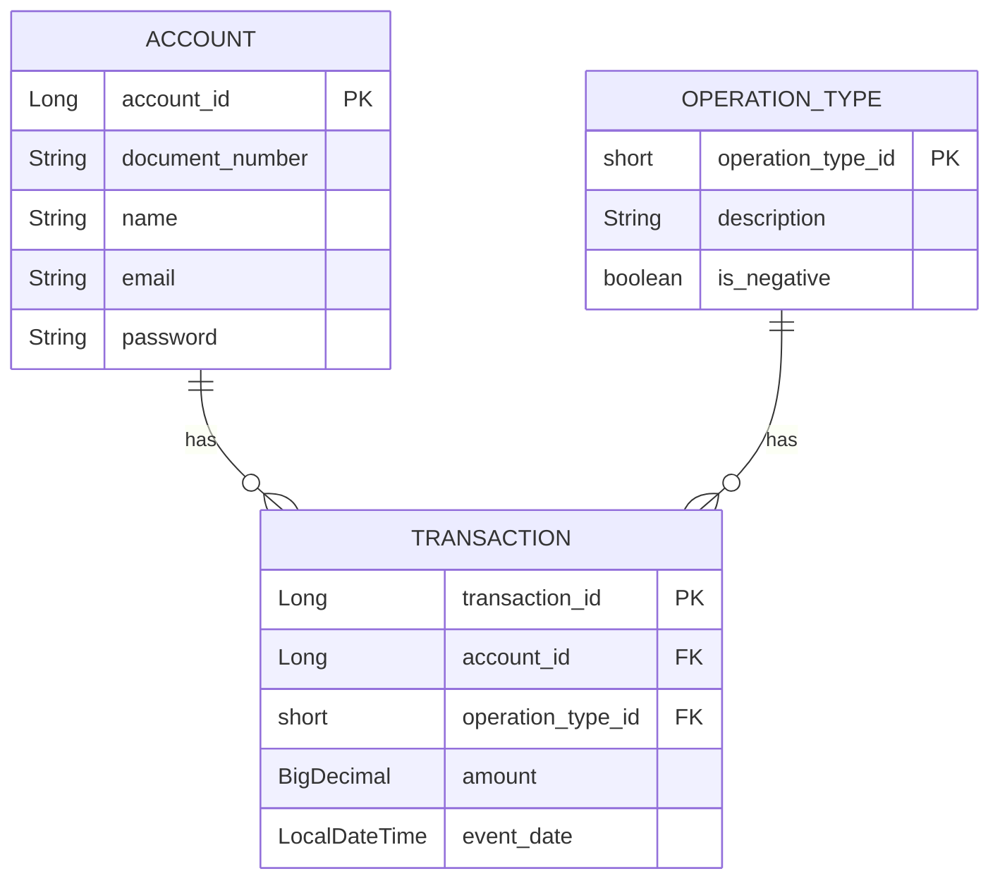

# Transactions API

This project is a simple API for managing customer transactions. It includes endpoints for creating accounts and transactions, and retrieving account information. The project is built using Java and Spring Boot.

## Table of Contents
- Getting Started
- Endpoints
- Running Tests
- Swagger API Documentation
- Security Configuration
- Database Structure

## Getting Started

### Prerequisites
- Java 17 or higher
- Maven
- Docker

### Run in local with postgresql
1. <b>Clone the repository </b>:
    ```bash
    git clone https://github.com/harsh2792/transaction-service.git
    cd transactions-service
    ```

2. <b>Make Scripts Executable</b>: Ensure the run.sh and run-test.sh scripts have execute permissions:
    ```bash
    chmod +x run.sh
    chmod +x run-test.sh
    ```
3. <b> Modify Application Properties </b>: Update the application.properties file.:
    ```bash
          # JWT Configuration
          security.jwt.secret-key=<your-secret-key>
          security.jwt.expiration-time=86400000

          # Database Configuration
          spring.datasource.url=postgres://<user>:<password>@db:5432/<database>
          spring.jpa.hibernate.ddl-auto=update
          spring.jpa.properties.hibernate.dialect=org.hibernate.dialect.PostgreSQLDialect

    ```
4. <b> Run the application </b>: Application can be run from mvn or shell script as below: 
    ```bash
    mvn spring-boot:run
    ```
    or 
     ```bash
    sh run.sh
    ```

### Run application with Docker compose

1. <b>Clone the repository </b>:
    ```bash
    git clone https://github.com/harsh2792/transaction-service.git
    cd transactions-service
    ```
2. <b>Build the Docker Images</b>: Build the Docker images using the following command:
```bash
docker-compose build
```

3. <b>Verify the Services</b>: Verify that the services are running correctly by checking the logs:

```bash
docker-compose logs
```

4. <b>Stop the Services</b>: Stop the services using the following command:

```bash
docker-compose down
```

## Endpoints

### Create an Account
- **URL:** `/api/accounts/`
- **Method:** `POST`
- **Summary:** Account creation
- **Description:** Register a new user with a password and email
- **Request Body:**
    ```json
    {
      "document_number": "12345678900",
      "name": "John Doe",
      "email": "john.doe@example.com",
      "password": "password123"
    }
    ```
- **Response Body:**
    ```json
    {
      "account_id": 1,
      "document_number": "12345678900",
      "name": "John Doe",
      "email": "john.doe@example.com"
    }
    ```

### Retrieve Account Information
- **URL:** `/api/accounts/{accountId}`
- **Method:** `GET`
- **Summary:** Get account details
- **Description:** Get account details based on account ID
- **Parameters:**
    - `accountId` (path parameter)
- **Response Body:**
    ```json
    {
      "account_id": 1,
      "document_number": "12345678900",
      "name": "John Doe",
      "email": "john.doe@example.com"
    }
    ```

### Account Login
- **URL:** `/api/accounts/login`
- **Method:** `POST`
- **Summary:** Account Login
- **Description:** Login a user with a password and email
- **Request Body:**
    ```json
    {
      "email": "john.doe@example.com",
      "password": "password123"
    }
    ```

### Get Current Account
- **URL:** `/api/accounts/me`
- **Method:** `GET`
- **Summary:** Get account details
- **Description:** Get account details based on account ID
- **Response Body:**
    ```json
    {
      "account_id": 1,
      "document_number": "12345678900",
      "name": "John Doe",
      "email": "john.doe@example.com"
    }
    ```

### Create a Transaction
- **URL:** `/api/transactions/`
- **Method:** `POST`
- **Summary:** Create a transaction
- **Description:** Create a new transaction for an account
- **Request Body:**
    ```json
    {
      "account_id": 1,
      "operation_type_id": 4,
      "amount": 123.45
    }
    ```
- **Response Body:**
    ```json
    {
      "transaction_id": 1,
      "account_id": 1,
      "operation_type_id": 4,
      "amount": 123.45,
      "event_date": "2024-09-01T14:00:34"
    }
    ```

### Get Transactions
- **URL:** `/api/transactions/`
- **Method:** `GET`
- **Summary:** Get transactions
- **Description:** Retrieve all transactions
- **Response Body:**
    ```json
    [
      {
        "transaction_id": 1,
        "account_id": 1,
        "operation_type_id": 4,
        "amount": 123.45,
        "event_date": "2024-09-01T14:00:34"
      },
      {
        "transaction_id": 2,
        "account_id": 1,
        "operation_type_id": 1,
        "amount": -50.0,
        "event_date": "2024-09-01T14:00:34"
      }
    ]
    ```

## Unit Tests

Unit tests are essential to ensure that your application behaves as expected. In this project, unit tests are written using JUnit and Spring Boot's testing framework. These tests cover various aspects of the application, including service logic and controller endpoints.

### Running Unit Tests
To run the unit tests, use the following command:
```bash
mvn clean test
```

### Generate test report
To run the unit tests, use the following command:
```bash
mvn jococo:report
```

or can use run-test.sh file to test and generate reports

```bash
sh ./run-test.sh
```


## Swagger API Documentation

Swagger is used to generate interactive API documentation for this project. It allows you to explore and test the API endpoints directly from the browser.

### Accessing Swagger UI

Once the application is running, you can access the Swagger UI at:
```
http://localhost:8080/swagger-ui.html

```


## Security Configuration
The application includes security configurations for authentication and authorization. Ensure you have the necessary credentials to access the endpoints.

## Database Structure



## Contact
If you have any questions, feel free to reach out.
